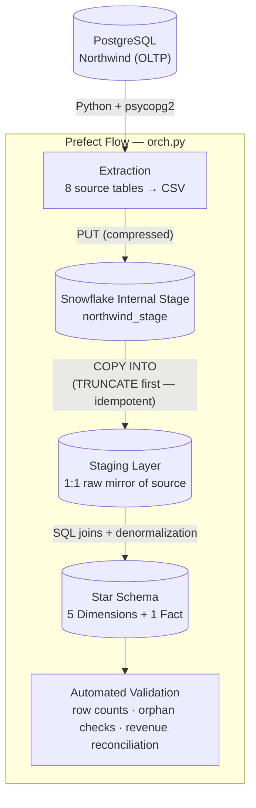
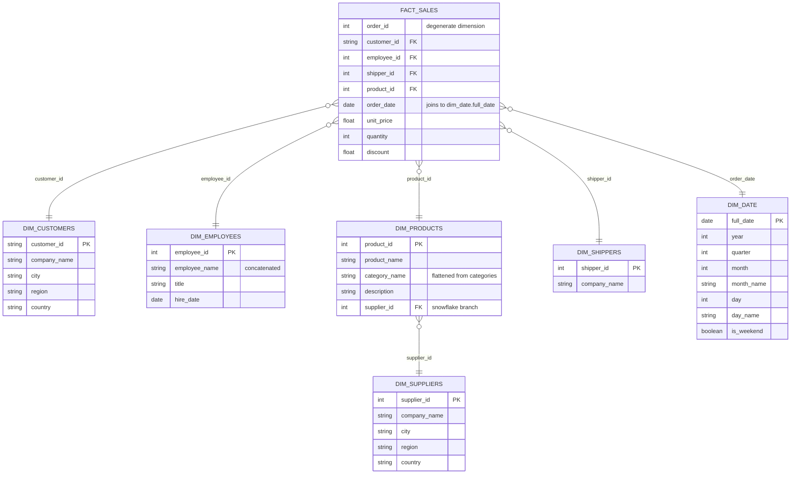

# Northwind ETL Pipeline — PostgreSQL → Snowflake

A hand-built, end-to-end ETL pipeline that extracts the classic **Northwind** dataset from a local **PostgreSQL** source, stages it in **Snowflake**, and transforms it into a Kimball-style **star schema** (with one deliberate snowflake branch) — orchestrated with **Prefect** and validated automatically before it's trusted.

This project was built to apply an Associate Data Engineer skillset to a real, working pipeline — not a tutorial copy-paste. Every design decision below was reasoned through deliberately, including a couple of real bugs that were found, diagnosed, and fixed along the way.

---

## Why this project

Most "Northwind ETL" projects on GitHub load the data and stop. This one goes a step further:

- A **dimensional model** designed from first principles — grain, measures, and denormalization decisions were all reasoned through, not copied from a tutorial.
- A **real data quality bug** (830 duplicate orders from a re-run `COPY INTO`) was caught during validation, root-caused, and fixed at the source (`TRUNCATE` before load) — not just patched after the fact.
- A **deliberate snowflake branch** (`dim_products → dim_suppliers`) where a pure star schema would have been the "default" choice — with the reasoning for *why* documented, not just implemented.
- **Idempotent, orchestrated execution** — the whole pipeline runs end-to-end with one command and can be safely re-run without duplicating data.
- **Automated validation that fails loudly** — row counts, orphan foreign keys, and revenue reconciliation are checked in code, not eyeballed in a UI.

---

## Architecture



Every stage above is a separate, testable Python/SQL unit, chained together by a single Prefect flow (`orch.py`) so the entire pipeline runs with one command: `python orch.py`.

---

## Data model

The core design decision was **grain**: one row in the fact table = **one product within one order** (the same grain as Northwind's `order_details` table). This was chosen deliberately over an order-level grain, since it's the most granular option and can always be aggregated up — but never back down.



### Why a snowflake branch, on purpose

`dim_products → dim_suppliers` is the one deliberate deviation from a pure star schema. `categories` was flattened straight into `dim_products` (it's just an ID and a label — no independent analytical depth). `suppliers`, on the other hand, has real geographic and business substance (city, region, country) and answers real standalone questions like *"which region do our top suppliers come from?"* — a question that has nothing to do with any single product. Promoting it to its own dimension, instead of duplicating supplier attributes across every product row, was the more correct Kimball-style call.

This is still a **Kimball bottom-up** design — one focused, business-process-driven data mart, built end-to-end. Snowflaking one branch for a genuine reason doesn't change that; snowflaking *everything* out of habit would have.

### Columns that were deliberately left out

Every dimension was trimmed down from its raw source table with a consistent test: *"would an analyst ever group or filter revenue by this?"* Columns like `phone`, `fax`, `contact_title`, `contact_name`, `address`, and `postal_code` were all dropped — they're operational/contact metadata, not analytical attributes. Product `units_in_stock`, `units_on_order`, and `reorder_level` were excluded from `dim_products` entirely, since they're a live inventory snapshot, not a historical sales fact — including them would make the warehouse describe *today's* stock rather than *the past's* sales.

---

## Project structure

```
Northwind-ETL-pipeline/
├── orch.py                      # Prefect flow — runs the whole pipeline end-to-end
├── requirements.txt
├── .env.example                 # required environment variables (no real values)
│
├── Setup/
│   └── creating_DB.sql          # Snowflake database + schema (infrastructure only)
│
├── Extraction/
│   ├── Extraction.py            # Postgres → CSV, incl. binary column handling
│   └── test_connection.py       # standalone Postgres connectivity check
│
├── Staging/
│   ├── stage_creation.py        # Snowflake internal stage
│   ├── staging_empty_tables.py  # staging table DDL (1:1 mirror of source)
│   ├── copyinto_stagingtables.py# PUT + COPY INTO (TRUNCATE first — idempotent)
│   └── staging_files.py
│
├── Transformation/
│   ├── dim_date_creation.sql    # generated, not sourced (GENERATOR + SEQ4 + DATEADD)
│   ├── dim_customers_creation.sql
│   ├── dim_employees_creation.sql
│   ├── dim_products_creation.sql
│   ├── dim_suppliers_creation.sql
│   ├── dim_shippers_creation.sql
│   ├── fact_sales.sql
│   └── transformation.py        # runs all of the above via execute_string()
│
├── Validation/
│   ├── validation.py            # raises on failure — row counts, orphans, reconciliation
│   ├── validation.sql
│   └── sanity_aggregation_check.sql
│
└── data/                        # extracted CSVs (git-ignored — regenerated on each run)
```

---

## How it works, stage by stage

**1. Extraction** — `Extraction.py` connects to PostgreSQL and pulls all 8 Northwind source tables into CSVs. One real problem solved here: two columns (`employees.photo`, `categories.picture`) are raw binary (`bytea`) data. Pandas' default CSV writer doesn't know how to serialize `bytes` objects — it silently wrote out Python memory addresses (`<memory at 0x...>`) instead of the actual bytes. Fixed by converting binary values to hex strings before writing (`value.hex()`), applied conditionally via `.apply()` only to the columns that need it.

**2. Staging** — CSVs are uploaded to a Snowflake internal stage (`PUT ... OVERWRITE = TRUE`, gzip-compressed automatically) and loaded into staging tables that mirror the source schema exactly — no transformation logic lives here on purpose. `FIELD_OPTIONALLY_ENCLOSED_BY = '"'` handles fields with embedded commas (e.g. addresses); `SKIP_HEADER = 1` skips the CSV header row. Every `COPY INTO` is preceded by a `TRUNCATE TABLE`, making re-runs safe.

**3. Transformation** — Staging tables are joined and denormalized into the star schema described above. `dim_date` is the one dimension generated independently rather than sourced, using Snowflake's `GENERATOR`/`SEQ4()` + `DATEADD()` to produce a clean, gap-free calendar spanning full years around the order data's actual date range.

**4. Validation** — Runs automatically as the pipeline's last step, and *fails the run* (raises an exception) rather than just printing a warning, if:
   - `fact_sales` row count doesn't match `stg_order_details`
   - any foreign key in `fact_sales` doesn't resolve to a row in its dimension table (orphan check)
   - total revenue calculated from `fact_sales` doesn't match total revenue calculated directly from staging

**5. Orchestration** — `orch.py` wires all four stages into a single Prefect flow, giving the pipeline retries, structured logging, and a one-command entry point (`python orch.py`) instead of a manual, error-prone sequence of steps.

---

## A real bug, found and fixed

During validation, `fact_sales` came back with **exactly double** the expected row count. Root-caused to `stg_orders` containing 830 duplicate `order_id` rows — the result of running `COPY INTO` twice against the same staging table while debugging earlier in the build, with no truncation step in between, silently appending instead of replacing.

The fix was two-fold: deduplicate the existing data, and structurally prevent it from happening again by adding `TRUNCATE TABLE` before every `COPY INTO`, making the whole staging load idempotent — safe to re-run any number of times without ever double-counting.

This is exactly the kind of bug that's easy to introduce and easy to miss without a validation step that actually checks numbers instead of assuming a script "ran without errors" means the data is correct.

---

## Setup & running it yourself

**Prerequisites:** PostgreSQL with the Northwind sample database loaded, an active Snowflake account, Python 3.11+.

```bash
# 1. Clone and install dependencies
git clone https://github.com/Seifo321/Northwind-ETL-pipeline.git
cd Northwind-ETL-pipeline
pip install -r requirements.txt

# 2. Configure credentials
cp .env.example .env
# then fill in .env with your own PostgreSQL and Snowflake credentials

# 3. Run the full pipeline
python orch.py
```

Credentials are never hardcoded — every script reads from environment variables via `python-dotenv`, and `.env` is git-ignored so real credentials never leave your machine.

---

## Tech stack

| Layer | Tool |
|---|---|
| Source system | PostgreSQL |
| Data warehouse | Snowflake |
| Extraction / transformation logic | Python (`pandas`, `psycopg2`, `snowflake-connector-python`) |
| Orchestration | Prefect |
| Modeling | Kimball dimensional modeling (star schema + one snowflake branch) |
| Credential management | `python-dotenv`, `.gitignore` |

---

## What's next

This project intentionally stayed a **full-refresh** pipeline — every run re-extracts the entire source, which is the right scope for a static sample dataset like Northwind. The natural next step is a second project applying **incremental loading / CDC (Change Data Capture)** to a domain where it actually matters — data that changes continuously, like a banking or transactions system — rather than retrofitting that complexity here where it wouldn't reflect a real constraint.

---

## Author

Built by **Seif Zakaria** — [GitHub](https://github.com/Seifo321) · [LinkedIn](https://linkedin.com/in/seif-zakaria)
